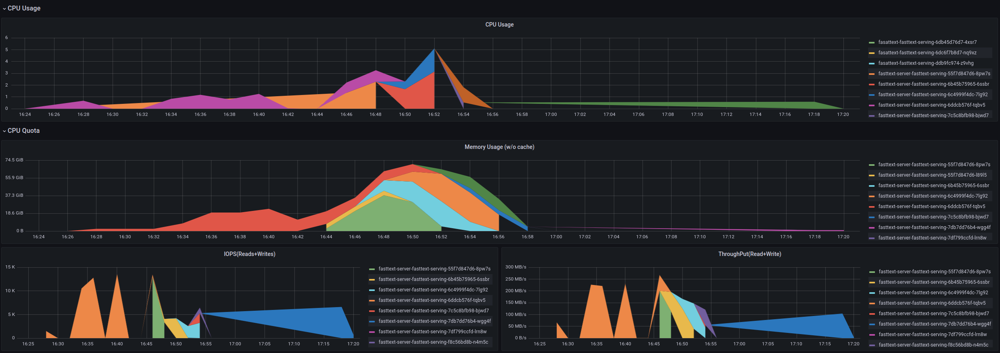

Часть кода взята из ресурсов https://github.com/dfederschmidt/fasttext-server и https://github.com/messense/fasttext-serving

Одна из попыток сделать fasttext работающим в приложении flask. 

/words"
def words():

Получить словарь.
Возвращает массив json, содержащий слова и частоты.
    
/predictions", methods=["GET"],endpoint="get_predictions")
Получите прогнозы для одного слова или предложения из развернутой модели.

        Строка запроса:
           * q (str): слово или предложение, для которого нужно получить векторное представление.
           * k (int): возвращено количество наиболее вероятных классов (по умолчанию: 1)
           * порог (с плавающей запятой): Фильтровать классы с вероятностью ниже порога (по умолчанию: 0,0)

        Возвращает:
            JSON, содержащий векторные представления.

@app.route("/predictions", methods=["POST"], endpoint="post_predictions")
def predictions():
    """
       Получите прогнозы для слов или предложений из развернутой модели.

        Строка запроса:
           * k (int): возвращено количество наиболее вероятных классов (по умолчанию: 1)
           * порог (с плавающей запятой): Фильтровать классы с вероятностью ниже порога (по умолчанию: 0,0)
        Тело:
           Массив строк json для получения классификаций.

        Возвращает:
            Массив json, содержащий векторные представления.
       """
   
@app.route("/representations", methods=["GET"], endpoint="get_representations")
def representations():
    """
    Получите векторные представления для одного слова или предложения из развернутой модели.

     Строка запроса:
        q (str): слово или предложение, для которого нужно получить векторное представление.

     Возвращает:
         JSON, содержащий векторное представление и его размерность.
    """

@app.route("/representations", methods=["POST"], endpoint="post_representations")
def representations():
    """
       Получите векторные представления для одного слова или предложения из развернутой модели.

        Тело:
           JSON-массив строк.

        Возвращает:
            Массив json, содержащий векторные представления.

curl -X POST -H 'Content-Type: application/json'      --data "[\"Тест гвозди?\", \"Пойдем?\"]"      'http://fasttext-serving.it-forever.ru/representations'

curl -X POST -H 'Content-Type: application/json'      --data "[\"Пойдем?\"]"      'http://fasttext-serving.it-forever.ru/predictions'